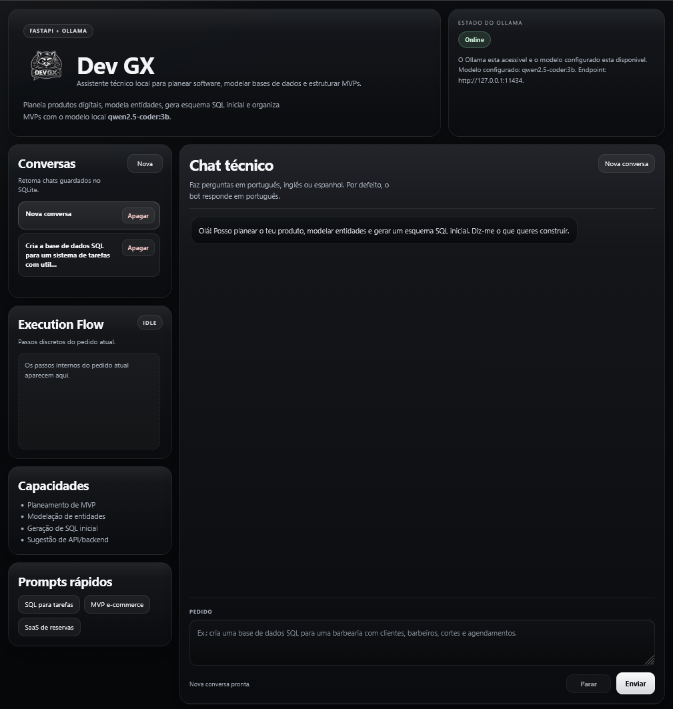
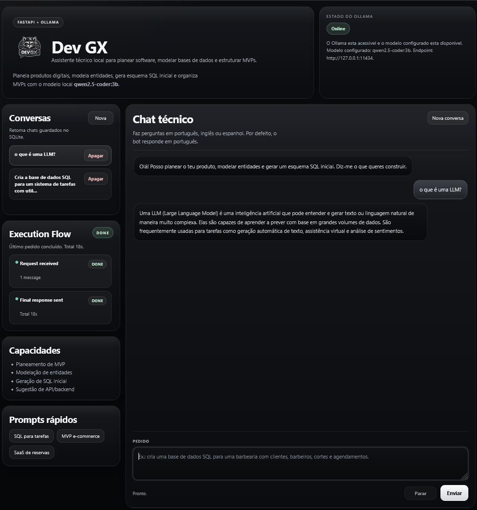
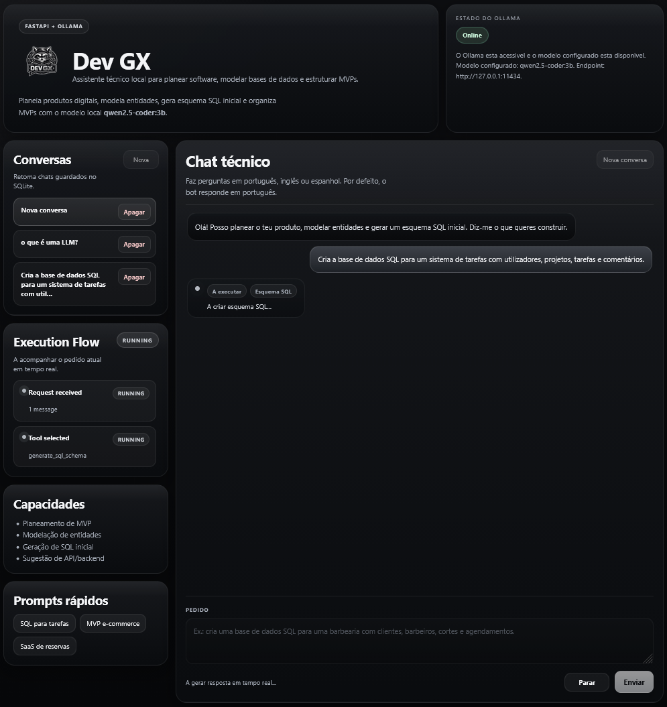
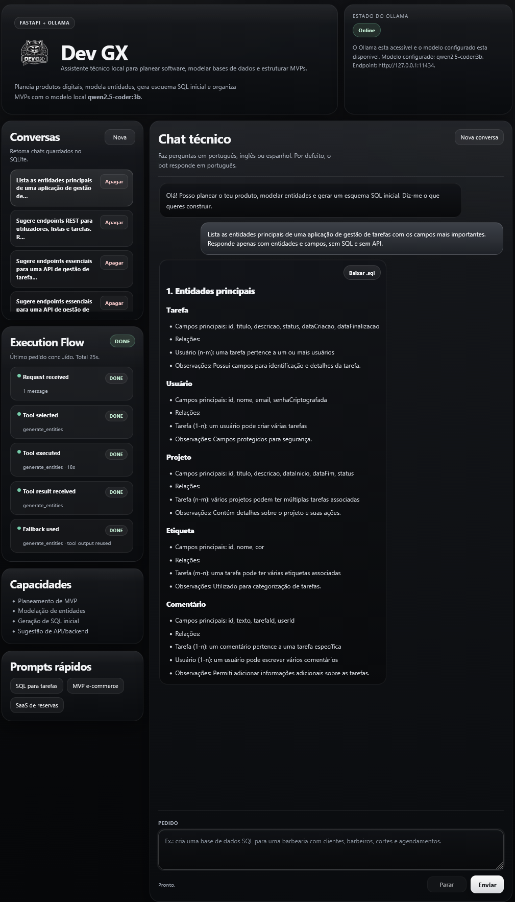
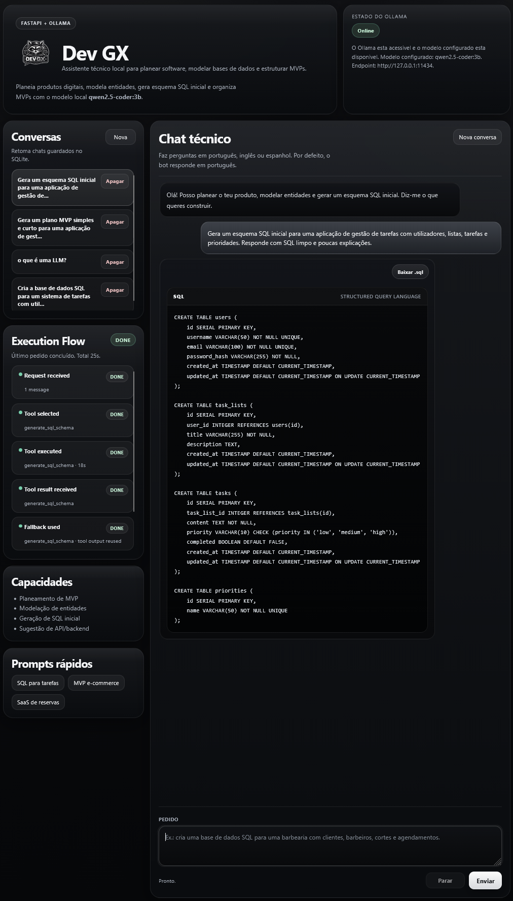
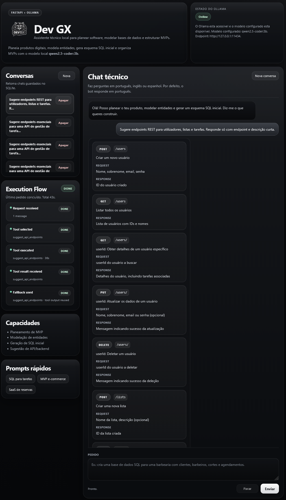

# Dev GX

Dev GX is a local AI software planning assistant built with FastAPI and Ollama. It helps transform product ideas into practical technical outputs such as MVP planning, entity modeling, API endpoint suggestions, and starter SQL schemas.



## Overview

Dev GX was designed to support early software planning workflows with a local-first approach. Instead of acting as a generic chatbot, it focuses on turning product ideas into structured technical outputs that are useful during project definition and prototyping.

The application provides a web interface where the user can describe a product idea and receive targeted outputs such as:

- MVP planning
- Entity modeling
- API endpoint suggestions
- Initial SQL schemas

It also includes conversation persistence with SQLite and optional MCP server integration.

## Main Features

- Local AI-powered software planning assistant
- Web interface built for practical planning workflows
- MVP planning generation
- Entity and domain modeling support
- REST API endpoint suggestions
- Starter SQL schema generation
- SQL export support
- Conversation history persisted with SQLite
- Optional MCP server integration

## Stack

- Python
- FastAPI
- Uvicorn
- Ollama
- Pydantic
- HTML, CSS, and JavaScript
- SQLite

## Screenshots

### Home


### Chat Experience



### Request Processing



### Entity Modeling



### SQL Schema Generation



### API Endpoint Suggestions



## Official Project Structure

```text
dev-gx/
|-- app/
|   |-- api/
|   |-- prompts/
|   |-- schemas/
|   |-- services/
|   |-- static/
|   |-- templates/
|   |-- tools/
|   |-- web/
|   |-- __init__.py
|   |-- config.py
|   `-- main.py
|-- docs/
|-- .env.example
|-- .gitignore
|-- LICENSE
|-- README.md
`-- requirements.txt
```

Runtime folders such as `app/data/` and `app/generated/` may be created automatically during execution. These directories store local runtime state, are ignored by Git, and are intentionally kept outside the documented source structure.

Local virtual environments such as `.venv/`, `app/.venv/`, or `app/venv/` are not part of the official project structure and should not be documented as source code.

## Installation

### 1. Clone the repository

```bash
git clone https://github.com/castroxdev/dev-gx.git
cd dev-gx
```

### 2. Create a virtual environment

**Windows**

```powershell
python -m venv .venv
.venv\Scripts\activate
```

**Linux / macOS**

```bash
python3 -m venv .venv
source .venv/bin/activate
```

### 3. Install dependencies

```bash
pip install -r requirements.txt
```

## Environment Configuration

Create a local `.env` file based on `.env.example`.

**Windows PowerShell**

```powershell
Copy-Item .env.example .env
```

**Linux / macOS**

```bash
cp .env.example .env
```

### Main environment variables

- `OLLAMA_BASE_URL` — URL of the local Ollama server
- `OLLAMA_MODEL` — model used by the planner
- `OLLAMA_TIMEOUT` — request timeout for generation
- `MCP_SERVER_ENABLED` — enables or disables MCP integration
- `MCP_SERVER_BASE_URL` — MCP server endpoint

## Run the Project

Start Ollama first and make sure the configured model is available. Then run the application from the project root:

```bash
uvicorn app.main:app --reload
```

After startup, open `http://127.0.0.1:8000` in your browser.

## Usage Notes

- Ollama must be running locally before starting Dev GX.
- The configured model must be available in your Ollama instance.
- The `.env` file should exist in the project root and be created from `.env.example`.
- `app/data/` and `app/generated/` are runtime-local directories created on demand and ignored by Git.
- Local virtual environments and machine-specific folders should stay outside the documented source structure.

## Troubleshooting

**Ollama model not available**  
Make sure Ollama is running and that the model defined in `.env` is installed locally.

**`.env` file not found**  
Create a `.env` file in the project root based on `.env.example`, then restart the server.

**Static files or templates do not load**  
Make sure you are starting the app from the project root with:

```bash
uvicorn app.main:app --reload
```

This ensures the package layout and centralized paths are resolved correctly.

## License

This project is licensed under the MIT License. See the [LICENSE](LICENSE) file for details.
