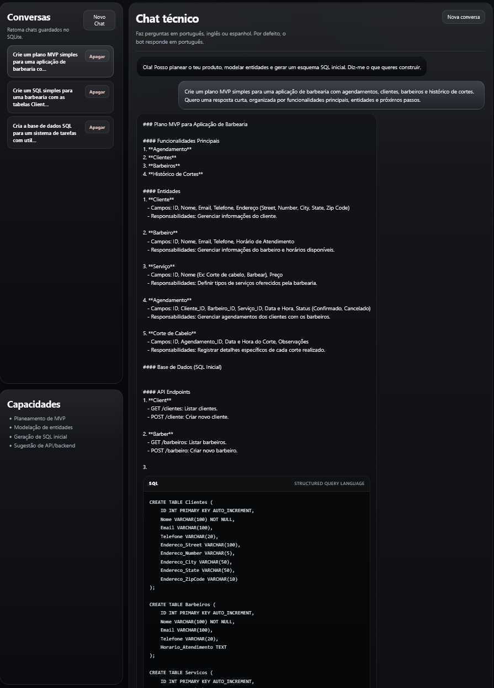
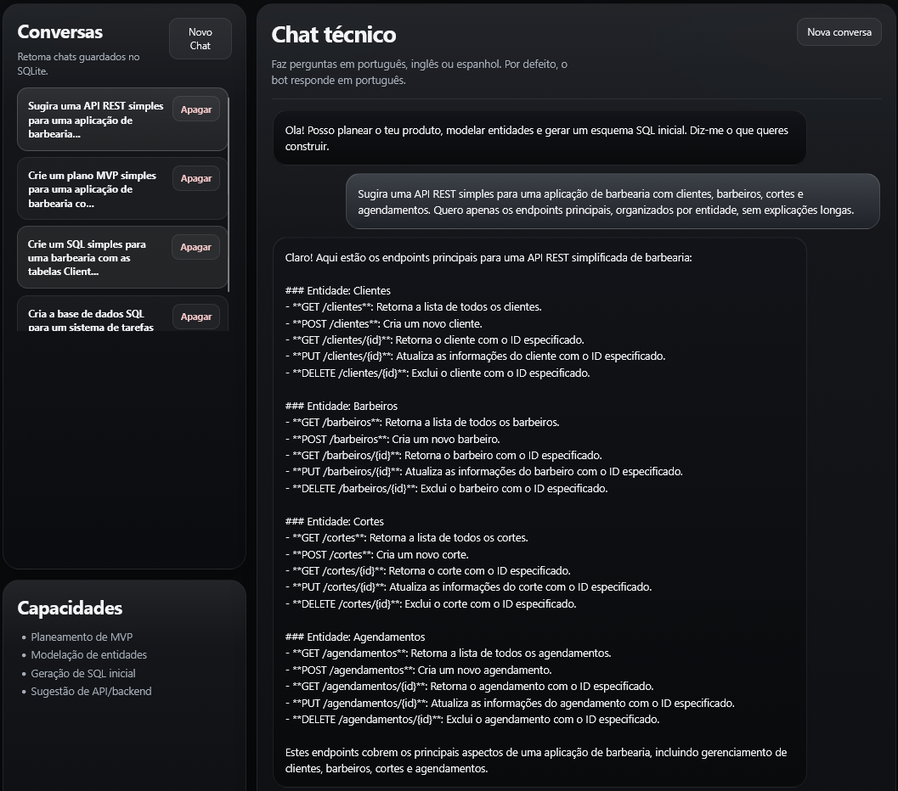

# Dev GX

Dev GX is a local AI software planning assistant built with FastAPI and Ollama. It helps turn product ideas into practical technical outputs such as MVP plans, entity definitions, API suggestions, and starter SQL schemas.


## Stack

- Python
- FastAPI
- Uvicorn
- Ollama
- Pydantic
- HTML, CSS and JavaScript
- SQLite

## Official Project Structure

```text
dev-gx/
|-- app/
|   |-- api/
|   |-- prompts/
|   |-- schemas/
|   |-- services/
|   |-- static/
|   |-- templates/
|   |-- tools/
|   |-- web/
|   |-- __init__.py
|   |-- config.py
|   `-- main.py
|-- docs/
|-- .env.example
|-- .gitignore
|-- LICENSE
|-- README.md
`-- requirements.txt
```

Runtime folders such as `app/data/` and `app/generated/` may be created automatically during execution. They are local state, are ignored by Git, and are intentionally kept outside the documented source structure.

Local virtual environments such as `.venv/`, `app/.venv/` or `app/venv/` are not part of the official structure and should not be documented as source code.

## Main Features

- Web interface for local software planning workflows
- Chat endpoint backed by a local Ollama model
- MVP planning generation
- Entity and API design guidance
- SQL schema generation and file export
- Conversation persistence with SQLite
- Optional MCP server integration for external tools

## Installation

### 1. Clone the repository

```bash
git clone https://github.com/castroxdev/dev-gx.git
cd dev-gx
```

### 2. Create a virtual environment

Windows:

```powershell
python -m venv .venv
.venv\Scripts\activate
```

Linux / macOS:

```bash
python3 -m venv .venv
source .venv/bin/activate
```

### 3. Install dependencies

```bash
pip install -r requirements.txt
```

## Environment Configuration

Create a local `.env` file based on `.env.example`.

Windows PowerShell:

```powershell
Copy-Item .env.example .env
```

Linux / macOS:

```bash
cp .env.example .env
```

Main variables:

- `OLLAMA_BASE_URL`: local Ollama server URL
- `OLLAMA_MODEL`: model used by the planner
- `OLLAMA_TIMEOUT`: request timeout for generation
- `MCP_SERVER_ENABLED`: enables or disables MCP integration
- `MCP_SERVER_BASE_URL`: MCP server endpoint

## Official Run Command

Start Ollama first and make sure the configured model is available. Run the application from the project root:

```bash
uvicorn app.main:app --reload
```

Open `http://127.0.0.1:8000` in the browser after startup.

## Notes About Runtime Directories

- `app/data/`: local SQLite conversation storage created on demand
- `app/generated/`: generated SQL and other exported artifacts created on demand
- `app/ui/`: obsolete local residue and not part of the project
- `app/venv/` and `app/.venv/`: local virtual environments, not part of the project

## Screenshots

### Home


### MVP Planning



### API Design



## License

This project is licensed under the MIT License. See the [LICENSE](LICENSE) file for details.
